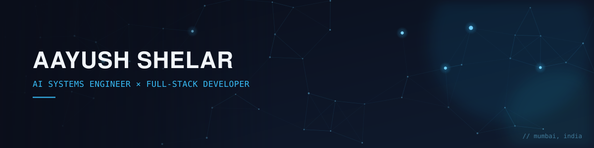
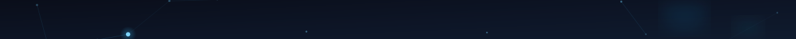
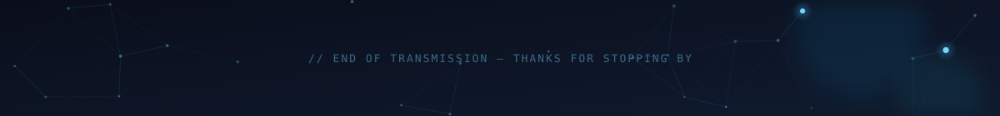

<div align="center">



<br>

<a href="https://www.linkedin.com/in/aayush-shelar-166b99249/"></a>

</div>

<br>

```bash
$ whoami
> Aayush Shelar — AI Systems Engineer, based in Mumbai

$ cat mission.txt
> Build things that still work when the network doesn't.
> RAG pipelines, multi-agent orchestration, edge ML —
> and the full-stack systems that wrap around them.

$ ls -la ./currently
> building/     Stone World — multiplayer survival, browser-native
> exploring/    agentic coding platforms, agent evaluation
> open_to/      AI Engineer & Full-Stack roles — remote or Mumbai

$ echo $CONTACT
> shelaraayush535@gmail.com
```

<br>



### 🧩 Selected builds

Small write-ups, not a project dump — these are the ones I'd actually walk you through.

<table>
<tr>
<td width="50%" valign="top">

**🩺 [edge-tb-triage](https://github.com/Aayush-pixel29/edge-tb-triage)**
TB screening shouldn't need a stable internet connection. This runs chest X-ray triage entirely on-device — MobileNetV2 + TFLite + Grad-CAM — for clinics where connectivity is the exception, not the rule.
<sub>`Python` `TFLite` `Computer Vision`</sub>

</td>
<td width="50%" valign="top">

**🛰️ [MAITRI](https://github.com/Aayush-pixel29/MAITRI)**
Built for ISRO's Smart India Hackathon: an offline multimodal companion that reads a crew member's audio + video to gauge emotional state and holds short, adaptive check-in conversations.
<sub>`Svelte` `TFLite` `Multimodal ML`</sub>

</td>
</tr>
<tr>
<td width="50%" valign="top">

**🕸️ [TriageMesh](https://github.com/Aayush-pixel29/TriageMesh)**
When cell towers go down, disaster response can't. Survivor triage relayed over a BLE mesh network, with bipartite-matching dispatch running on whatever infrastructure survives.
<sub>`JavaScript` `BLE Mesh` `Systems Design`</sub>

</td>
<td width="50%" valign="top">

**🧭 [Recon AI](https://github.com/Aayush-pixel29/recon-ai-buildathon)**
An agentic, offline-first coordination platform for disaster response, built to keep functioning in zero-connectivity zones — Gemini-powered when it can reach the network, self-sufficient when it can't.
<sub>`Next.js` `Agentic AI` `Offline-first`</sub>

</td>
</tr>
<tr>
<td width="50%" valign="top">

**⚙️ [SRE-Autonomous](https://github.com/Aayush-pixel29/SRE-Autonomous)**
A multi-agent triage swarm for SRE/FinOps work — LangChain agents backed by hybrid Qdrant + BM25 retrieval, tuned down to ~250ms.
<sub>`LangChain` `Multi-Agent` `Qdrant`</sub>

</td>
<td width="50%" valign="top">

**🌍 [Stone World](https://aayush-pixel29.github.io/stone-world/)** — *in progress*
The project with no deadline and no client — a browser-based multiplayer survival game with real-time avatar sync, a bloom post-processing pipeline, and whatever else felt fun to build this week.
<sub>`JavaScript` `WebGL` `Multiplayer`</sub>

</td>
</tr>
</table>

<br>


### 🛠️ Stack

<p align="center">


<br>


<br>


<br>


</p>

<br>

<div align="center">


<br>


<br><br>

<!--
  Animated snake — generated by .github/workflows/snake.yml (Platane/snk).
  It stays empty until the workflow runs once. See the setup note at the
  bottom of this file for the two clicks needed to switch it on.
-->
<picture>
  <source media="(prefers-color-scheme: dark)" srcset="https://raw.githubusercontent.com/Aayush-pixel29/aayush-pixel29/output/github-contribution-grid-snake-dark.svg" />
  <source media="(prefers-color-scheme: light)" srcset="https://raw.githubusercontent.com/Aayush-pixel29/aayush-pixel29/output/github-contribution-grid-snake.svg" />
  
</picture>

</div>

<br>

<div align="center">

### 📫 Let's connect

<a href="https://www.linkedin.com/in/aayush-shelar-166b99249/"></a>
<a href="mailto:shelaraayush535@gmail.com"></a>
<a href="https://www.kaggle.com/aayushshelar"></a>
<a href="https://leetcode.com/u/pywmntvknk/"></a>

<br><br>


<br><br>



</div>
